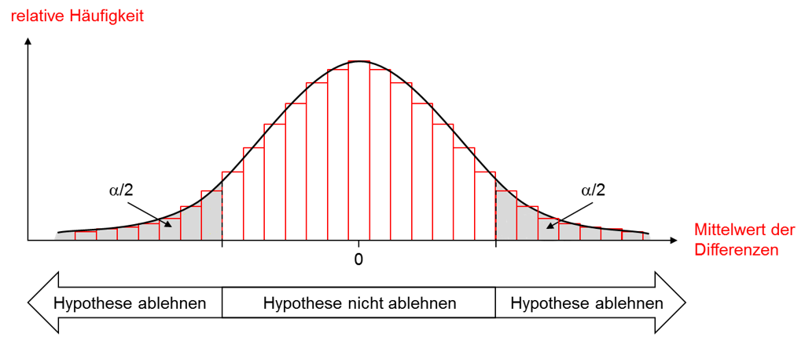

```{r setup, include=FALSE}
knitr::opts_chunk$set(echo = TRUE)
library(MASS)
data(Boston)
library(VGAM)
library(moments)
```
### Allgemeines bezüglich Hypothesen (Normalverteilung):
####Zentralen Grenzwertsatz
Wegen dem Zentralen Grenzwertsatz ist davon auszugehen, dass die verschiedenen Stichproben normalverteilt
sind nach $\overline{x} \sim (\mu,\frac{\sigma^2}{n})$.  
Der p-Wert gibt an, wie wahrscheinlich es ist, eine Stichprobe zu ziehen, die $H_1$ zumindest so stark wie unsere.

#### p-wert
unterstützt, sofern die Nullhypothese gilt. Wenn diese Wahrscheinlichkeit unter $\alpha$ liegt, wird die Nullhypothese abgelehnt. 

#### Z-Statistik
Eine Z-Statistik wird durch die Formel $z=\frac{\overline{x}-\mu_0}{\frac{\sigma}{\sqrt{n}}}$ beschreiben. Falls der Stichprobenumfang n $\geq$ 30 ist, sind die Werte der Z-Statistik der der T-Statistik so ähnlich, dass auch die Z-Statistik verwendet werden kann.

#### Kritischer Bereich
Der kritische Bereich gibt an, in welcher Reichweite die werte liegen können, damit die Nullhypothese gültig ist. Er kann mitteils einer einfachen Umformung der Formel der z-Statistik berechnet wrden: $\overline{x} = z*\frac{\sigma}{\sqrt{n}}+\mu_0$  
```{r pressure, echo=FALSE, fig.cap="Quelle:https://www.ifad.de/einfuehrung-in-signifikanztests/ Zugegriffen am: 2018-12-19", out.width = '50%'}

```
Für $\alpha$ haben wir bei unseren Hypothesen 5 % angenommen. 

#### Güte (Power)
Die Güte (Power) gibt an, mit welcher Wahrscheinlichkeit ein statistischer Test die abzulehnende Nullhypothese $H_0$ („Es gibt keinen Unterschied“) korrekt zurückweist, wenn die Alternativhypothese $H_1$ („Es gibt einen Unterschied“) wahr ist. Die Güte des Tests kann also als „Ablehnungskraft“ des Tests interpretiert werden.
### Analyse und berechnungen: 
```{r child = 'julia_analyse.Rmd'}
```
```{r child = 'tobias_analyse.Rmd'}
```
```{r child = 'markus_analyse.Rmd'}
```
```{r child = 'julia_main.Rmd'}
```
```{r child = 'tobias_main.Rmd'}
```
```{r child = 'markus_main.Rmd'}
```